# Request-Response Flow — NuGet Package Management

This document illustrates the request-response flow for the most common package management scenarios in the VS Code OPM extension, showing how user interactions flow through the architecture layers.

## Architecture Overview

The extension follows a layered architecture:
- **UI Layer**: Views (TreeDataProvider) and Webviews (Lit components)
- **Command Layer**: Thin orchestrators that validate and coordinate
- **Domain Layer**: Provider-agnostic abstractions (models, parsers, interfaces)
- **Environment Layer**: Concrete implementations (dotnet CLI executor, NuGet API client)

## Primary Use Cases Covered

1. **Search & Browse Packages** — User searches for packages via webview
2. **Install Package** — User installs a package to one or more projects
3. **View Installed Packages** — User views packages in tree view
4. **Update Package** — User updates an installed package
5. **View Package Details** — User clicks a package to see full details

---

## Sequence Diagram: Complete Package Management Flow

```mermaid
%%{init: {'theme':'dark', 'themeVariables': { 'fontSize':'16px'}}}%%
sequenceDiagram
    participant User
    participant WebView as Package Browser<br/>(Webview/Lit)
    participant TreeView as Installed Packages<br/>(TreeDataProvider)
    participant Command as Command Layer<br/>(installPackage.ts)
    participant DomainSvc as DomainProviderService
    participant Provider as NuGetProvider<br/>(Domain Interface)
    participant APIClient as NuGet API Client<br/>(env/node)
    participant CLIExecutor as dotnet CLI Executor<br/>(env/node)
    participant Parser as Parser/Transformer<br/>(domain/parsers)
    participant Cache as PromiseCache<br/>(domain/cache)

    %% Use Case 1: Search & Browse Packages
    Note over User,Cache: Use Case 1: Search & Browse Packages
    User->>WebView: Enter search term "Newtonsoft"
    WebView->>WebView: Debounce input (300ms)
    WebView->>Command: request('searchPackages', { query: 'Newtonsoft', prerelease: false })
    Command->>DomainSvc: searchPackages(query, options)
    DomainSvc->>Provider: searchPackages(query, options)
    
    Provider->>Cache: check('search:Newtonsoft:stable')
    alt Cache Hit
        Cache-->>Provider: cached PackageSearchResult[]
    else Cache Miss
        Provider->>APIClient: GET /query?q=Newtonsoft&prerelease=false
        APIClient-->>Provider: JSON response
        Provider->>Parser: parseSearchResults(json)
        Parser-->>Provider: PackageSearchResult[]
        Provider->>Cache: store('search:Newtonsoft:stable', results, ttl: 5min)
    end
    
    Provider-->>DomainSvc: PackageSearchResult[]
    DomainSvc-->>Command: PackageSearchResult[]
    Command-->>WebView: response({ results: [...] })
    WebView->>WebView: Render package list with metadata
    WebView->>User: Display search results

    %% Use Case 2: View Package Details
    Note over User,Cache: Use Case 2: View Package Details
    User->>WebView: Click "Newtonsoft.Json"
    WebView->>Command: request('getPackageDetails', { id: 'Newtonsoft.Json' })
    Command->>DomainSvc: getPackageDetails('Newtonsoft.Json')
    DomainSvc->>Provider: getPackageDetails(packageId)
    
    Provider->>Cache: check('details:Newtonsoft.Json')
    alt Cache Hit
        Cache-->>Provider: cached PackageDetails
    else Cache Miss
        Provider->>APIClient: GET /registration/newtonsoft.json/index.json
        APIClient-->>Provider: JSON catalog
        Provider->>Parser: parsePackageDetails(catalog)
        Parser-->>Provider: PackageDetails (versions, deps, readme, license)
        Provider->>Cache: store('details:Newtonsoft.Json', details, ttl: 10min)
    end
    
    Provider-->>DomainSvc: PackageDetails
    DomainSvc-->>Command: PackageDetails
    Command-->>WebView: response({ details: {...} })
    WebView->>WebView: Render details panel (readme, versions, deps)
    WebView->>User: Display package details

    %% Use Case 3: Install Package
    Note over User,Cache: Use Case 3: Install Package (Multi-Project)
    User->>WebView: Select version "13.0.3", check projects [A, B]
    User->>WebView: Click "Install"
    WebView->>Command: request('installPackage', { id, version, projects: ['A', 'B'] })
    Command->>Command: Validate inputs & check project paths
    Command->>DomainSvc: installPackage(packageId, version, projectPaths)
    
    loop For each project
        DomainSvc->>Provider: installPackage(packageId, version, projectPath)
        Provider->>CLIExecutor: exec('dotnet add package Newtonsoft.Json --version 13.0.3', cwd: projectPath)
        CLIExecutor-->>Provider: { stdout, stderr, exitCode }
        
        alt Success (exitCode 0)
            Provider->>Parser: parseInstallOutput(stdout)
            Parser-->>Provider: InstallResult { success: true, packageId, version }
        else Error
            Provider->>Parser: parseErrorOutput(stderr)
            Parser-->>Provider: InstallResult { success: false, error: { code, message } }
        end
        
        Provider-->>DomainSvc: InstallResult
    end
    
    DomainSvc->>Cache: invalidate('installed:*')
    DomainSvc-->>Command: InstallResult[]
    Command->>TreeView: refresh() - trigger tree update
    Command-->>WebView: response({ results: [...] })
    WebView->>User: Show success toast / error details
    TreeView->>User: Updated installed packages tree

    %% Use Case 4: View Installed Packages (Tree View)
    Note over User,Cache: Use Case 4: View Installed Packages (Tree View)
    User->>TreeView: Expand "Installed Packages"
    TreeView->>TreeView: getChildren(undefined)
    TreeView->>DomainSvc: getInstalledPackages(workspacePath)
    DomainSvc->>Provider: getInstalledPackages(workspacePath)
    
    Provider->>Cache: check('installed:workspace')
    alt Cache Hit
        Cache-->>Provider: cached InstalledPackage[]
    else Cache Miss
        Provider->>CLIExecutor: exec('dotnet list package', cwd: workspace)
        CLIExecutor-->>Provider: stdout (table format)
        Provider->>Parser: parseInstalledPackages(stdout)
        Parser-->>Provider: InstalledPackage[] (id, version, latestVersion)
        Provider->>Cache: store('installed:workspace', packages, ttl: 2min)
    end
    
    Provider-->>DomainSvc: InstalledPackage[]
    DomainSvc-->>TreeView: InstalledPackage[]
    TreeView->>TreeView: Transform to TreeItem nodes
    TreeView->>User: Display installed packages with update badges

    %% Use Case 5: Update Package
    Note over User,Cache: Use Case 5: Update Package
    User->>TreeView: Right-click package node, "Update"
    TreeView->>Command: execute({ packageId, currentVersion })
    Command->>Command: Show QuickPick for target version or "Latest"
    User->>Command: Select "Latest"
    Command->>DomainSvc: updatePackage(packageId, 'latest', projectPaths)
    
    DomainSvc->>Provider: updatePackage(packageId, targetVersion, projectPaths)
    
    loop For each project
        Provider->>APIClient: GET /registration/{id}/index.json (get latest version)
        APIClient-->>Provider: latestVersion
        Provider->>CLIExecutor: exec('dotnet add package {id} --version {latest}', cwd: project)
        CLIExecutor-->>Provider: { stdout, stderr, exitCode }
        Provider->>Parser: parseUpdateOutput(stdout)
        Parser-->>Provider: UpdateResult
        Provider-->>DomainSvc: UpdateResult
    end
    
    DomainSvc->>Cache: invalidate('installed:*')
    DomainSvc-->>Command: UpdateResult[]
    Command->>TreeView: refresh(packageNode)
    Command->>User: Show information message "Updated {id} to {version}"
    TreeView->>User: Refresh tree node with new version

    %% Use Case 6: Check for Updates (Tree View Badge)
    Note over User,Cache: Use Case 6: Check for Updates (Background)
    TreeView->>TreeView: onDidChangeTreeData event
    TreeView->>DomainSvc: getInstalledPackages(workspace)
    DomainSvc->>Provider: getInstalledPackages(workspace)
    Provider->>CLIExecutor: exec('dotnet list package --outdated')
    CLIExecutor-->>Provider: stdout (outdated packages table)
    Provider->>Parser: parseOutdatedPackages(stdout)
    Parser-->>Provider: OutdatedPackage[] (id, current, latest)
    Provider-->>DomainSvc: OutdatedPackage[]
    DomainSvc-->>TreeView: OutdatedPackage[]
    TreeView->>TreeView: Add update badge to TreeItem.description
    TreeView->>User: Show "↑ 14.0.1" badge on outdated packages
```



---

## Data Flow Summary

### 1. **Search Flow**
- **Input**: User query string + filters (prerelease, framework)
- **API**: NuGet Search API (v3) → JSON results
- **Transform**: Parser extracts id, version, description, downloads, iconUrl
- **Output**: `PackageSearchResult[]` → Webview renders list

### 2. **Package Details Flow**
- **Input**: Package ID
- **API**: NuGet Registration API → JSON catalog (all versions + metadata)
- **Transform**: Parser extracts versions, dependencies, readme, license, deprecation
- **Output**: `PackageDetails` → Webview renders details panel

### 3. **Install Flow**
- **Input**: Package ID, version, target projects
- **CLI**: `dotnet add package {id} --version {version}` per project
- **Transform**: Parser validates success/error from stdout/stderr
- **Side Effect**: Invalidate installed package cache
- **Output**: `InstallResult[]` → UI toast + tree refresh

### 4. **Installed Packages Flow**
- **Input**: Workspace path
- **CLI**: `dotnet list package` (parses .csproj files)
- **Transform**: Parser extracts package references from table output
- **Output**: `InstalledPackage[]` → Tree view nodes

### 5. **Update Flow**
- **Input**: Package ID, target version ('latest' or specific)
- **API**: NuGet Registration API (if 'latest', resolve version)
- **CLI**: `dotnet add package {id} --version {resolved}`
- **Transform**: Parser validates update success
- **Side Effect**: Invalidate cache + refresh tree node
- **Output**: `UpdateResult[]` → UI confirmation

### 6. **Updates Available Flow**
- **Input**: Workspace path
- **CLI**: `dotnet list package --outdated`
- **Transform**: Parser extracts outdated package info (current vs. latest)
- **Output**: `OutdatedPackage[]` → Tree item badges

---

## Key Architecture Patterns

### 1. **Cache Strategy**
- **Search results**: 5 min TTL (user searches repeatedly during exploration)
- **Package details**: 10 min TTL (metadata changes infrequently)
- **Installed packages**: 2 min TTL (invalidated on install/update/uninstall)
- **Outdated check**: No cache (always fresh on explicit refresh)

### 2. **Request Deduplication**
- `PromiseCache` prevents duplicate in-flight requests
- Example: Multiple tree nodes requesting same package details → single API call

### 3. **Error Handling**
- Parsers return structured errors: `{ code: 'NotFound' | 'Auth' | 'Exec', message, details }`
- Commands translate errors to user-friendly messages
- Webview shows inline error states (not just toasts)

### 4. **Multi-Project Batching**
- Commands accept `projectPaths: string[]`
- Provider executes CLI operations sequentially (dotnet doesn't support batch)
- Partial success handling: collect all results, report per-project status

### 5. **IPC Protocol (Webview ↔ Host)**
```typescript
// Request shape
{ type: 'request', id: string, name: 'searchPackages', args: { query, prerelease } }

// Response shape
{ type: 'response', id: string, success: true, result: PackageSearchResult[] }
// or
{ type: 'response', id: string, success: false, error: { code, message } }

// Notification (host → webview)
{ type: 'notification', name: 'packageInstalled', args: { packageId, version } }
```

---

## Performance Considerations

1. **Debounced Search**: 300ms debounce on search input to reduce API calls
2. **Lazy Tree Expansion**: Only load children when node expanded
3. **Background Updates Check**: Run on activation + manual refresh (not on every tree render)
4. **Incremental Refresh**: Use `onDidChangeTreeData.fire(node)` for single-node updates
5. **API Rate Limiting**: Respect NuGet API rate limits (use exponential backoff on 429)

---

## Extension Points for Future Enhancements

- **Vulnerability Scanning**: Add sub-provider for NuGet vulnerability DB
- **Central Package Management**: Parse `Directory.Packages.props` in provider
- **Private Feeds**: Extend API client with auth handlers (Bearer, Basic)
- **Dependency Graph Visualization**: Add webview with D3.js tree layout
- **Quick Fixes**: VS Code code actions to suggest package installs for missing types

---

Created to provide a comprehensive reference for understanding the request-response flow in the NuGet package management extension.
